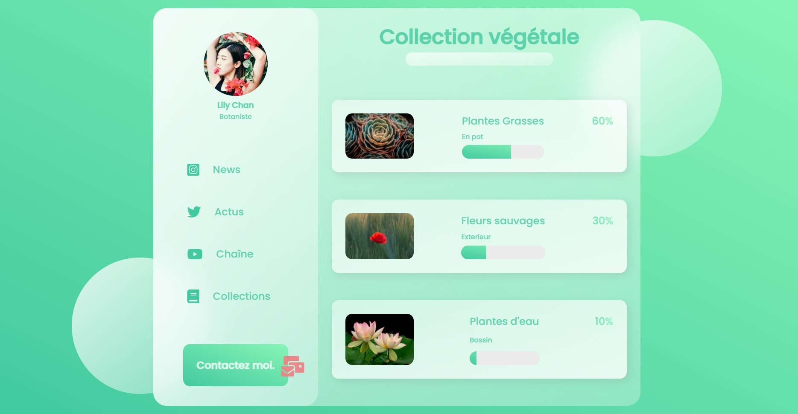

# GlassDesign
Glass effect Design HTML CSS

No JS. 
FontAwesome files included.  Just download files and run index.html 
If you use the images (free on unsplash.com), please keep the photos credits (html footer). 
Original tutorial by <a href="https://youtu.be/O7WbVj5apxU">Dev Ed</a>
